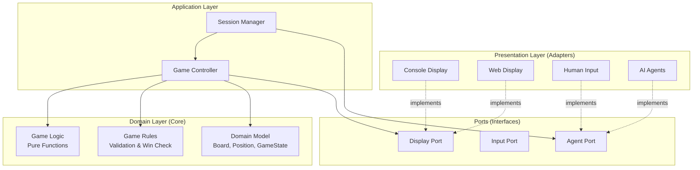
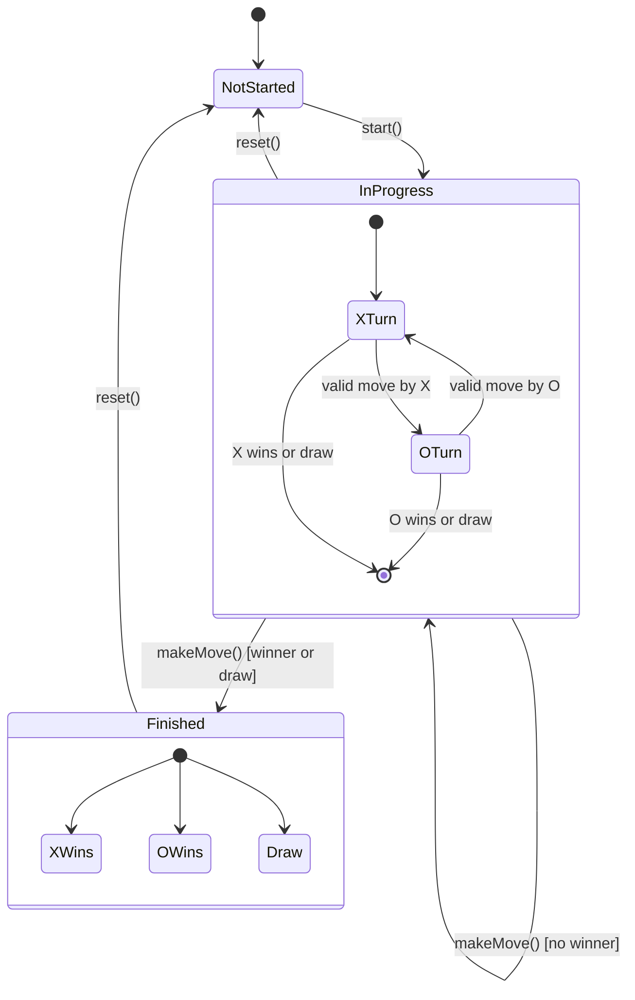
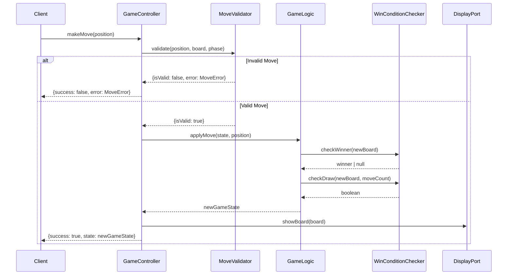

# Improved Reference Architecture

## Overview

This document presents the improved architecture incorporating all design patterns, SOLID principles, and best practices identified in the design review.

---

## High-Level Architecture Diagram



---

## Detailed Class Diagram

```mermaid
classDiagram

%% ============================================================================
%% DOMAIN MODEL - Pure data structures
%% ============================================================================

class Position {
    <<value object>>
    -int index
    +Position(index: int)
    +Position(row: int, col: int)
    +getRow() int
    +getCol() int
    +getIndex() int
    +equals(other: Position) boolean
}

class Marker {
    <<enumeration>>
    X
    O
}

class GamePhase {
    <<enumeration>>
    NOT_STARTED
    IN_PROGRESS
    FINISHED
}

class GameResult {
    <<enumeration>>
    NOT_DETERMINED
    X_WINS
    O_WINS
    DRAW
}

class Move {
    <<interface>>
    +readonly position: Position
    +readonly marker: Marker
    +readonly moveNumber: int
}

class Board {
    <<immutable>>
    -readonly cells: ReadonlyArray~Marker | null~
    +Board(cells?: ReadonlyArray)
    +getCell(position: Position) Marker | null
    +isEmpty(position: Position) boolean
    +isFull() boolean
    +withMove(position: Position, marker: Marker) Board
    +getAllCells() ReadonlyArray
}

class GameState {
    <<interface>>
    +readonly board: Board
    +readonly phase: GamePhase
    +readonly result: GameResult
    +readonly currentTurn: Marker
    +readonly moveHistory: ReadonlyArray~Move~
}

%% ============================================================================
%% GAME LOGIC - Pure functions
%% ============================================================================

class GameLogic {
    <<static>>
    +createInitialState() GameState
    +startGame(state: GameState) GameState
    +applyMove(state: GameState, position: Position) GameState
    +reset(state: GameState) GameState
}

%% ============================================================================
%% GAME RULES - Validation and checking
%% ============================================================================

class MoveError {
    <<enumeration>>
    INVALID_POSITION
    CELL_OCCUPIED
    WRONG_TURN
    GAME_NOT_IN_PROGRESS
    GAME_ALREADY_FINISHED
}

class ValidationResult {
    <<interface>>
    +isValid: boolean
    +error?: MoveError
}

class MoveValidator {
    +validate(position: Position, board: Board, phase: GamePhase) ValidationResult
    +getValidMoves(board: Board) Position[]
}

class WinConditionChecker {
    -readonly WIN_PATTERNS: int[][]
    +checkWinner(board: Board) Marker | null
    +checkDraw(board: Board, moveCount: int) boolean
}

%% ============================================================================
%% RESULT TYPES
%% ============================================================================

class MoveResult {
    <<discriminated union>>
    +success: boolean
    +state?: GameState
    +error?: MoveError
}

%% ============================================================================
%% APPLICATION LAYER
%% ============================================================================

class GameController {
    -state: GameState
    -readonly validator: MoveValidator
    -readonly winChecker: WinConditionChecker
    +constructor()
    +start() void
    +makeMove(position: Position) MoveResult
    +getState() GameState
    +reset() void
    +getValidMoves() Position[]
}

%% ============================================================================
%% SESSION MANAGEMENT
%% ============================================================================

class Player {
    +readonly name: string
    +wins: int
    +readonly agent: Agent
    +constructor(name: string, agent: Agent)
}

class Session {
    -readonly player1: Player
    -readonly player2: Player
    -draws: int
    -currentGame: GameController | null
    +constructor(player1: Player, player2: Player)
    +getPlayer1() Player
    +getPlayer2() Player
    +getDraws() int
    +startNewGame() GameController
    +getCurrentGame() GameController | null
    +recordResult(result: GameResult) void
    +getStats() SessionStats
}

%% ============================================================================
%% PORTS - Interfaces for external systems
%% ============================================================================

class DisplayPort {
    <<interface>>
    +showBoard(board: Board) void
    +showMessage(message: string) void
    +showGameResult(result: GameResult) void
}

class Agent {
    <<interface>>
    +getNextMove(board: Board, validMoves: Position[]) Promise~Position~
}

%% ============================================================================
%% ADAPTERS - Implementations
%% ============================================================================

class ConsoleDisplay {
    <<adapter>>
    +showBoard(board: Board) void
    +showMessage(message: string) void
    +showGameResult(result: GameResult) void
}

class WebDisplay {
    <<adapter>>
    +showBoard(board: Board) void
    +showMessage(message: string) void
    +showGameResult(result: GameResult) void
}

class HumanAgent {
    <<adapter>>
    -inputPort: InputPort
    +constructor(inputPort: InputPort)
    +getNextMove(board: Board, validMoves: Position[]) Promise~Position~
}

class RandomAI {
    <<adapter>>
    +getNextMove(board: Board, validMoves: Position[]) Promise~Position~
}

class MinimaxAI {
    <<adapter>>
    -maxDepth: int
    -cache: Map
    +constructor(maxDepth: int)
    +getNextMove(board: Board, validMoves: Position[]) Promise~Position~
}

%% ============================================================================
%% RELATIONSHIPS
%% ============================================================================

%% Composition
GameState *-- "1" Board
GameState *-- "1" GamePhase
GameState *-- "1" GameResult
GameState *-- "1" Marker
GameState *-- "*" Move

Board ..> Position : uses
Board ..> Marker : uses

Move *-- "1" Position
Move *-- "1" Marker

GameController *-- "1" GameState
GameController *-- "1" MoveValidator
GameController *-- "1" WinConditionChecker

Session *-- "2" Player
Session o-- "0..1" GameController

Player *-- "1" Agent

%% Dependencies
GameLogic ..> GameState : transforms
GameLogic ..> WinConditionChecker : uses

MoveValidator ..> Position : validates
MoveValidator ..> Board : validates
MoveValidator ..> GamePhase : validates
MoveValidator ..> MoveError : returns
MoveValidator ..> ValidationResult : returns

WinConditionChecker ..> Board : checks
WinConditionChecker ..> Marker : returns

GameController ..> GameLogic : uses
GameController ..> MoveResult : returns

%% Interface implementations
ConsoleDisplay ..|> DisplayPort
WebDisplay ..|> DisplayPort
HumanAgent ..|> Agent
RandomAI ..|> Agent
MinimaxAI ..|> Agent

%% Adapters depend on domain
ConsoleDisplay ..> Board : displays
HumanAgent ..> Position : returns
RandomAI ..> Position : returns
MinimaxAI ..> Position : returns
```



---

## Layer Separation

### Core Domain (Innermost Layer)
**No dependencies on outer layers**

```typescript
// src/core/domain/
Position.ts
Marker.ts (enum)
GamePhase.ts (enum)
GameResult.ts (enum)
Board.ts
GameState.ts (interface)
Move.ts (interface)
```

**Characteristics:**
- Pure TypeScript
- No external dependencies
- Immutable data structures
- Value objects
- No I/O, no side effects

### Core Logic (Inner Layer)
**Depends only on Domain**

```typescript
// src/core/logic/
GameLogic.ts        // Pure functions
GameRules.ts        // Business rules
MoveValidator.ts    // Validation logic
WinConditionChecker.ts
```

**Characteristics:**
- Pure functions
- Stateless
- Highly testable
- No I/O

### Application Layer (Middle Layer)
**Depends on Domain and Logic**

```typescript
// src/application/
GameController.ts   // Orchestrates domain logic
SessionManager.ts   // Manages sessions
```

**Characteristics:**
- Orchestrates use cases
- Manages state
- Can have side effects (through ports)
- Depends on abstractions (ports), not concretions

### Ports (Interfaces)
**Defines contracts**

```typescript
// src/ports/
DisplayPort.ts
InputPort.ts
StoragePort.ts
Agent.ts
```

**Characteristics:**
- Just interfaces
- No implementations
- Defines what the application needs

### Adapters (Outer Layer)
**Implements ports, depends on everything**

```typescript
// src/adapters/
display/
  ConsoleDisplay.ts
  WebDisplay.ts
input/
  ConsoleInput.ts
  WebInput.ts
agents/
  HumanAgent.ts
  RandomAI.ts
  MinimaxAI.ts
```

**Characteristics:**
- Concrete implementations
- Framework-specific code
- I/O operations
- External integrations

---

## Dependency Flow

```
┌─────────────────────────────────────────┐
│         Adapters (Outer)                │
│  ConsoleDisplay, WebDisplay, Agents     │
│                                         │
│  ┌───────────────────────────────────┐ │
│  │    Ports (Interfaces)             │ │
│  │  DisplayPort, Agent               │ │
│  │                                   │ │
│  │  ┌─────────────────────────────┐ │ │
│  │  │  Application Layer          │ │ │
│  │  │  GameController, Session    │ │ │
│  │  │                             │ │ │
│  │  │  ┌───────────────────────┐ │ │ │
│  │  │  │  Core Logic           │ │ │ │
│  │  │  │  GameLogic, Rules     │ │ │ │
│  │  │  │                       │ │ │ │
│  │  │  │  ┌─────────────────┐ │ │ │ │
│  │  │  │  │  Core Domain    │ │ │ │ │
│  │  │  │  │  Board, State   │ │ │ │ │
│  │  │  │  └─────────────────┘ │ │ │ │
│  │  │  └───────────────────────┘ │ │ │
│  │  └─────────────────────────────┘ │ │
│  └───────────────────────────────────┘ │
└─────────────────────────────────────────┘

Dependencies point inward →
Inner layers know nothing about outer layers
```

---

## State Flow Diagram



---

## Move Processing Flow



---

## Complete Type Definitions

```typescript
// ============================================================================
// DOMAIN TYPES
// ============================================================================

export enum Marker {
  X = 'X',
  O = 'O'
}

export enum GamePhase {
  NOT_STARTED = 'NOT_STARTED',
  IN_PROGRESS = 'IN_PROGRESS',
  FINISHED = 'FINISHED'
}

export enum GameResult {
  NOT_DETERMINED = 'NOT_DETERMINED',
  X_WINS = 'X_WINS',
  O_WINS = 'O_WINS',
  DRAW = 'DRAW'
}

export class Position {
  private readonly index: number

  constructor(index: number)
  constructor(row: number, col: number)
  constructor(rowOrIndex: number, col?: number) {
    if (col === undefined) {
      this.index = rowOrIndex
    } else {
      this.index = rowOrIndex * 3 + col
    }
  }

  getIndex(): number { return this.index }
  getRow(): number { return Math.floor(this.index / 3) }
  getCol(): number { return this.index % 3 }
  equals(other: Position): boolean { return this.index === other.index }
  toString(): string { return `(${this.getRow()}, ${this.getCol()})` }
}

export interface Move {
  readonly position: Position
  readonly marker: Marker
  readonly moveNumber: number
}

export interface GameState {
  readonly board: Board
  readonly phase: GamePhase
  readonly result: GameResult
  readonly currentTurn: Marker
  readonly moveHistory: readonly Move[]
}

// ============================================================================
// ERROR TYPES
// ============================================================================

export enum MoveError {
  INVALID_POSITION = 'Position is out of bounds',
  CELL_OCCUPIED = 'Cell is already occupied',
  WRONG_TURN = 'It is not your turn',
  GAME_NOT_IN_PROGRESS = 'Game is not in progress',
  GAME_ALREADY_FINISHED = 'Game has already finished'
}

export interface ValidationResult {
  isValid: boolean
  error?: MoveError
}

export type MoveResult =
  | { success: true; state: GameState }
  | { success: false; error: MoveError }

// ============================================================================
// PORT INTERFACES
// ============================================================================

export interface DisplayPort {
  showBoard(board: Board): void
  showMessage(message: string): void
  showGameResult(result: GameResult): void
}

export interface Agent {
  getNextMove(board: Board, validMoves: readonly Position[]): Promise<Position>
}

export interface InputPort {
  getPosition(): Promise<Position>
}

export interface StoragePort {
  saveGame(gameState: GameState): Promise<void>
  loadGame(id: string): Promise<GameState>
}
```

---

## Design Patterns Applied

### 1. Strategy Pattern
**Where:** Agent interface with multiple implementations
**Why:** Different player types (human, random AI, minimax AI)

```typescript
interface Agent {
  getNextMove(board: Board, validMoves: Position[]): Promise<Position>
}

class HumanAgent implements Agent { /* ... */ }
class RandomAI implements Agent { /* ... */ }
class MinimaxAI implements Agent { /* ... */ }
```

### 2. Ports and Adapters (Hexagonal Architecture)
**Where:** DisplayPort, Agent interfaces with multiple adapters
**Why:** Completely decouple core from display/input systems

```typescript
interface DisplayPort { /* ... */ }
class ConsoleDisplay implements DisplayPort { /* ... */ }
class WebDisplay implements DisplayPort { /* ... */ }
```

### 3. Immutable Object Pattern
**Where:** Board, GameState
**Why:** Predictable state, easy undo/redo, thread-safe

```typescript
class Board {
  withMove(position: Position, marker: Marker): Board {
    // Returns new board, doesn't mutate
  }
}
```

### 4. Pure Functions
**Where:** GameLogic
**Why:** Testable, predictable, no side effects

```typescript
const GameLogic = {
  applyMove(state: GameState, position: Position): GameState {
    // Pure function - no side effects
  }
}
```

### 5. Value Object Pattern
**Where:** Position
**Why:** Immutable, equality by value, no identity

```typescript
class Position {
  equals(other: Position): boolean {
    return this.index === other.index
  }
}
```

### 6. Result Type Pattern
**Where:** MoveResult, ValidationResult
**Why:** Type-safe error handling without exceptions

```typescript
type MoveResult =
  | { success: true; state: GameState }
  | { success: false; error: MoveError }
```

### 7. Dependency Injection
**Where:** GameController constructor
**Why:** Testability, flexibility, inversion of control

```typescript
class GameController {
  constructor(
    private validator: MoveValidator,
    private winChecker: WinConditionChecker
  ) {}
}
```

---

## SOLID Principles Applied

### Single Responsibility Principle (SRP) ✅
- **Board**: Only manages board state
- **MoveValidator**: Only validates moves
- **WinConditionChecker**: Only checks win conditions
- **GameLogic**: Only transforms game state
- **GameController**: Only orchestrates (one responsibility)

### Open/Closed Principle (OCP) ✅
- **Agent interface**: Open for extension (new AI types), closed for modification
- **DisplayPort**: Can add new displays without changing core
- **WinConditionChecker**: Can be extended for different board sizes/rules

### Liskov Substitution Principle (LSP) ✅
- Any **Agent** implementation can replace another
- Any **DisplayPort** implementation can replace another
- All implementations honor the contracts

### Interface Segregation Principle (ISP) ✅
- **Agent**: Single focused method
- **DisplayPort**: Only display-related methods
- No fat interfaces

### Dependency Inversion Principle (DIP) ✅
- **GameController** depends on abstractions (MoveValidator, WinConditionChecker)
- **High-level modules** don't depend on low-level modules
- Both depend on abstractions (interfaces)

---

## Key Improvements from Original Design

| Aspect | Original Design | Improved Design |
|--------|----------------|-----------------|
| **GameStatus** | Single enum mixing turn and outcome | Separated: GamePhase + GameResult + currentTurn |
| **Game class** | Handles everything (SRP violation) | Split: GameController + GameLogic + GameRules |
| **Board** | Bit manipulation (complex) | Simple array (clear, maintainable) |
| **Error handling** | Missing | Result types, MoveError enum |
| **State** | Likely mutable | Immutable (Board, GameState) |
| **Move concept** | Just Position | Move object with metadata |
| **Win checking** | Unclear where it lives | Dedicated WinConditionChecker |
| **Validation** | Unclear where it lives | Dedicated MoveValidator |
| **Display coupling** | Not addressed | Ports & Adapters (completely decoupled) |
| **Testability** | Difficult (stateful) | Easy (pure functions, immutable) |

---

## Migration Path from Original Design

### Step 1: Extract Win Checking
```typescript
// Before: Inside Game class
class Game {
  applyMove(position: Position): void {
    // ... mixed with win checking
  }
}

// After: Separate class
class WinConditionChecker { /* ... */ }
class Game { /* ... uses WinConditionChecker */ }
```

### Step 2: Split GameStatus
```typescript
// Before
enum GameStatus { X_TURN, O_TURN, X_WINS, O_WINS, DRAW }

// After
enum GamePhase { NOT_STARTED, IN_PROGRESS, FINISHED }
enum GameResult { NOT_DETERMINED, X_WINS, O_WINS, DRAW }
interface GameState {
  phase: GamePhase
  result: GameResult
  currentTurn: Marker
}
```

### Step 3: Make Board Immutable
```typescript
// Before
class Board {
  setMarker(position: Position, marker: Marker): boolean { /* mutates */ }
}

// After
class Board {
  withMove(position: Position, marker: Marker): Board { /* returns new */ }
}
```

### Step 4: Extract Pure Logic
```typescript
// Before: Logic mixed in Game class
class Game { /* stateful, methods mutate */ }

// After: Pure functions
const GameLogic = {
  applyMove(state: GameState, position: Position): GameState { /* pure */ }
}
```

---

## Conclusion

This improved architecture provides:

✅ **Separation of Concerns** - Each class has one clear responsibility
✅ **Testability** - Pure functions, immutable state, dependency injection
✅ **Maintainability** - Clear structure, SOLID principles
✅ **Extensibility** - Easy to add new agents, displays, rules
✅ **Type Safety** - Strong typing, result types, no nulls
✅ **Predictability** - Immutable state, pure functions
✅ **Decoupling** - Display system completely separate from core
✅ **Professional Quality** - Industry best practices

**Your management will be impressed, and your families will be proud!** 🎉
