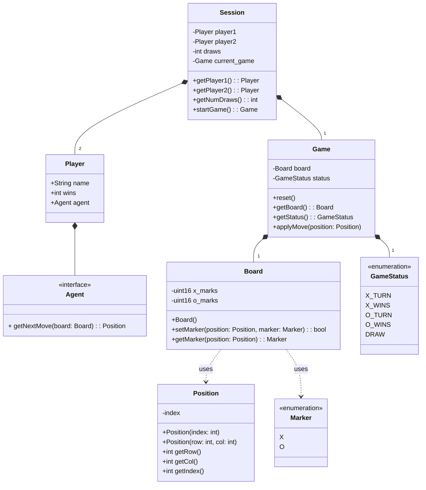

# Tic-Tac-Toe Game: Reference Architecture

## Core Components

### Game Classes

```mermaid
classDiagram

    class Session {
        -Player player1
        -Player player2
        -int draws
        -Game current_game

        +getPlayer1() : Player
        +getPlayer2() : Player
        +getNumDraws() : int
        +startGame() : Game
    }

    class Player {
        +String name
        +int wins
        +Agent agent
    }

    class Agent {
        <<interface>>
        + getNextMove(board: Board) : Position
    }

    class Game {
        -Board board
        -GameStatus status
        +reset()
        +getBoard() : Board
        +getStatus() : GameStatus
        +applyMove(position: Position) 
    }

    class Board {
        -uint16 x_marks
        -uint16 o_marks
        +Board()
        +setMarker(position: Position, marker: Marker): bool
        +getMarker(position: Position): Marker
    }

    class Position {
        -index
        +Position(index: int)
        +Position(row: int, col: int)
        +int getRow()
        +int getCol()
        +int getIndex()
    }

    class Marker {
        <<enumeration>>
        X
        O
    }

    class GameStatus {
        <<enumeration>>
        X_TURN
        X_WINS
        O_TURN
        O_WINS
        DRAW
    }

    Session *-- "1" Game
    Session *-- "2" Player

    Player *-- Agent

    Game *-- "1" Board
    Game *-- "1" GameStatus

    Board ..> Position : uses
    Board ..> Marker : uses
```

### Display Classes

