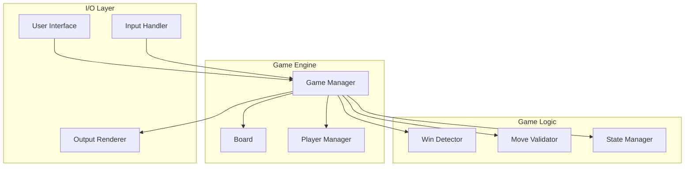
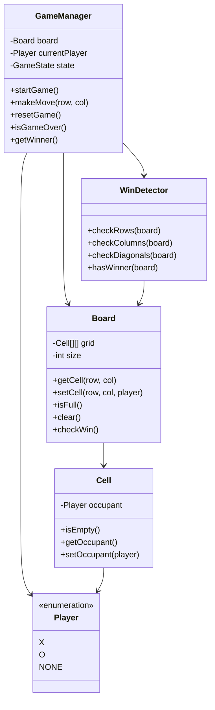
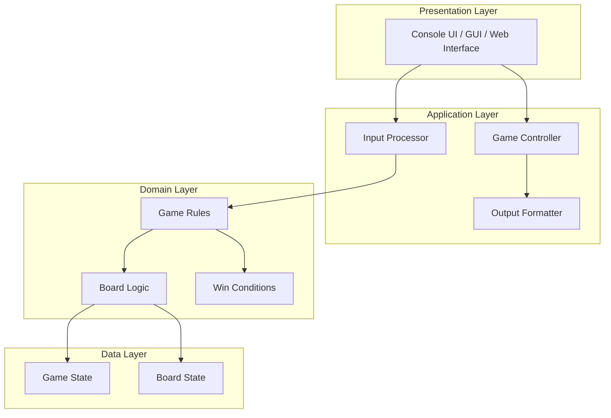
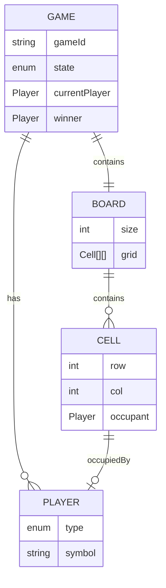
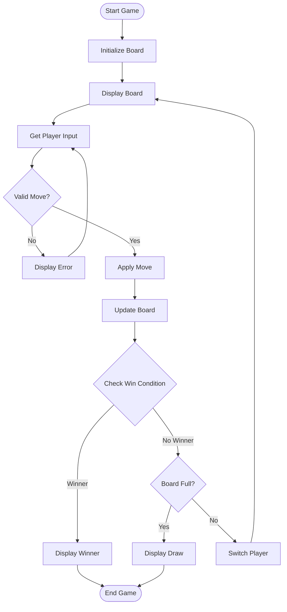
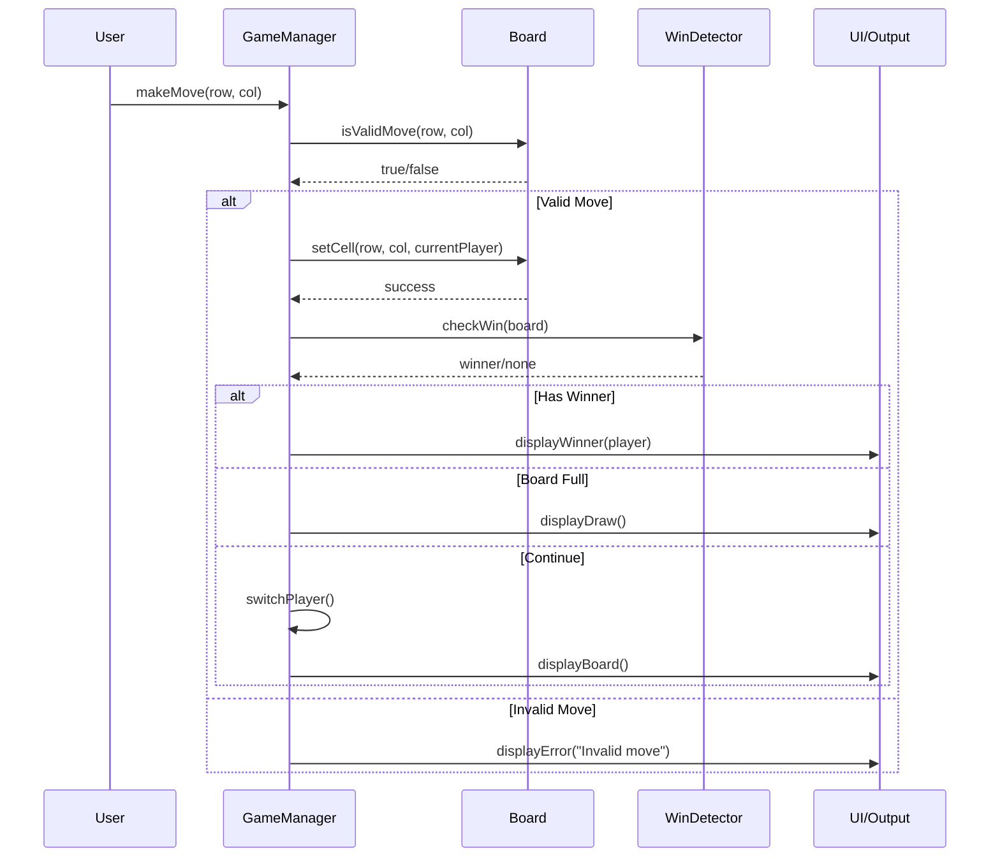
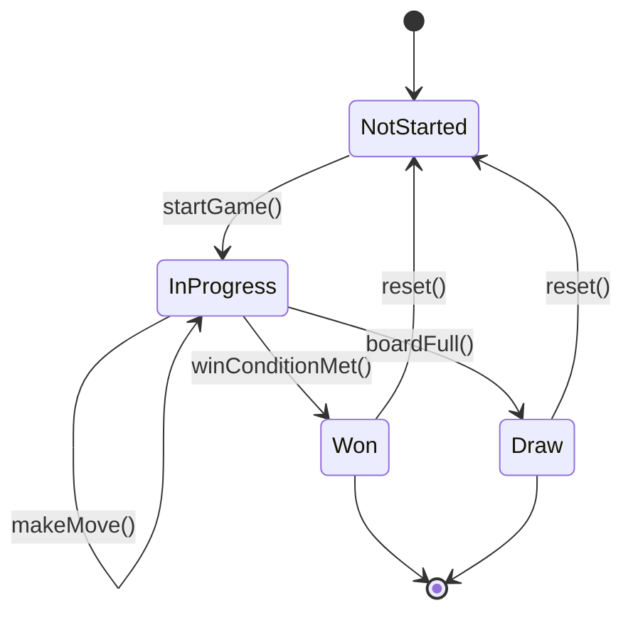
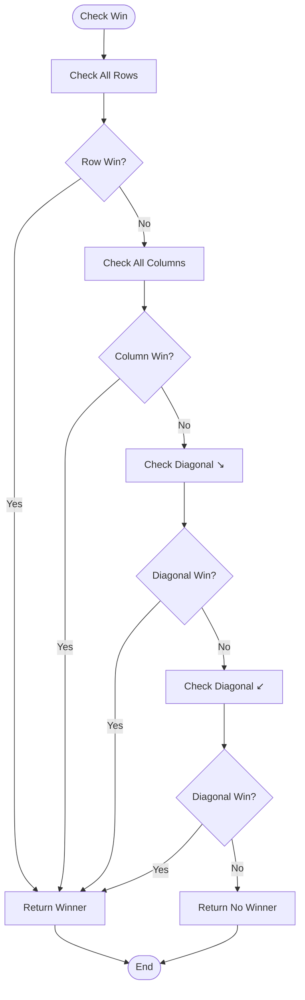
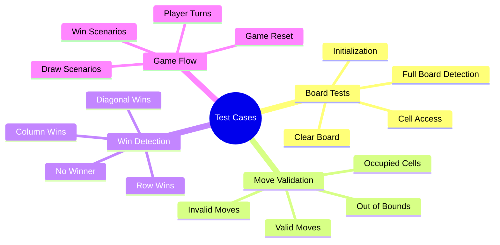

# Tic-Tac-Toe Game: Reference Architecture

**Version:** 1.0
**Status:** Draft
**Last Updated:** 2026-01-17
**Author:** Engineering Team

---

## Table of Contents

1. [Executive Summary](#executive-summary)
2. [Architecture Overview](#architecture-overview)
3. [Core Components](#core-components)
4. [System Architecture](#system-architecture)
5. [Data Models](#data-models)
6. [Game Flow](#game-flow)
7. [Interface Specifications](#interface-specifications)
8. [State Management](#state-management)
9. [Win Detection Algorithm](#win-detection-algorithm)
10. [Input/Output Specifications](#inputoutput-specifications)
11. [Error Handling](#error-handling)
12. [Testing Strategy](#testing-strategy)
13. [Implementation Guidelines](#implementation-guidelines)
14. [Language-Specific Considerations](#language-specific-considerations)
15. [Appendices](#appendices)

---

## Executive Summary

### Purpose

_This section will provide a high-level overview of the reference architecture and its goals._

### Scope

_This section will define what is included and excluded from this architecture._

### Goals

_This section will outline the key objectives of this reference architecture._

---

## Architecture Overview

### High-Level Architecture

### Design Principles

_This section will describe the core design principles that guide all implementations._

---

## Core Components

### Component Diagram

### Component Descriptions

#### Game Manager

_Detailed description of the Game Manager component responsibilities._

#### Board

_Detailed description of the Board component responsibilities._

#### Player

_Detailed description of the Player component responsibilities._

#### Win Detector

_Detailed description of the Win Detector component responsibilities._

---

## System Architecture

### Layered Architecture

### Layer Responsibilities

_This section will define the responsibilities of each architectural layer._

---

## Data Models

### Board State Model

_Detailed specification of how the board state is represented._

### Player Model

_Detailed specification of player representation._

### Game State Model

_Detailed specification of overall game state._

### Data Structure Requirements

---

## Game Flow

### Main Game Loop

### Sequence Diagram: Making a Move

---

## Interface Specifications

### Public API Requirements

_This section will define the required public interfaces for all implementations._

### Input Interface

_This section will specify how user input should be handled._

### Output Interface

_This section will specify how game output should be rendered._

---

## State Management

### State Transitions

### State Definitions

_This section will define each game state and its characteristics._

---

## Win Detection Algorithm

### Win Conditions

_This section will specify all win conditions in detail._

### Algorithm Specification

### Performance Requirements

_This section will specify performance expectations for win detection._

---

## Input/Output Specifications

### Input Validation Rules

_This section will define all input validation requirements._

### Output Formatting Standards

_This section will define output format requirements for consistency._

### Error Messages

_This section will standardize error messaging across implementations._

---

## Error Handling

### Error Categories

_This section will categorize types of errors that must be handled._

### Error Handling Strategy

_This section will define how each error type should be handled._

---

## Testing Strategy

### Test Coverage Requirements

_This section will define minimum test coverage expectations._

### Unit Testing

_This section will specify unit testing requirements for each component._

### Integration Testing

_This section will specify integration testing requirements._

### Test Cases

---

## Implementation Guidelines

### Naming Conventions

_This section will establish naming standards across all language implementations._

### Code Organization

_This section will define how code should be structured and organized._

### Documentation Requirements

_This section will specify documentation standards._

---

## Language-Specific Considerations

### C++

_Specific guidelines for C++ implementation._

### Python

_Specific guidelines for Python implementation._

### JavaScript/TypeScript

_Specific guidelines for JavaScript/TypeScript implementation._

### Other Languages

_Guidelines for additional language implementations._

---

## Appendices

### Appendix A: Glossary

_Key terms and definitions._

### Appendix B: References

_External references and resources._

### Appendix C: Change History

| Version | Date | Author | Changes |
|---------|------|--------|---------|
| 1.0 | 2026-01-17 | Engineering Team | Initial draft |

---

**Document Control**

- **Classification:** Internal
- **Distribution:** Engineering Team
- **Review Cycle:** Quarterly
- **Next Review:** 2026-04-17
