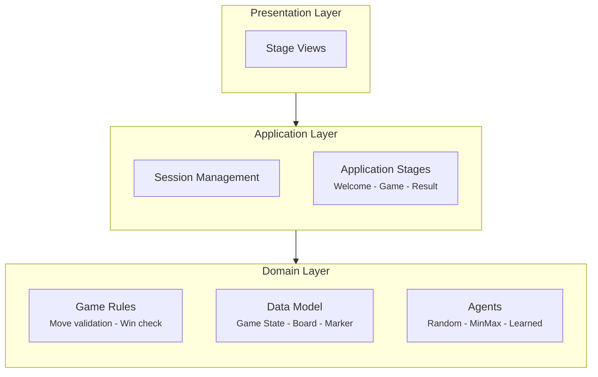
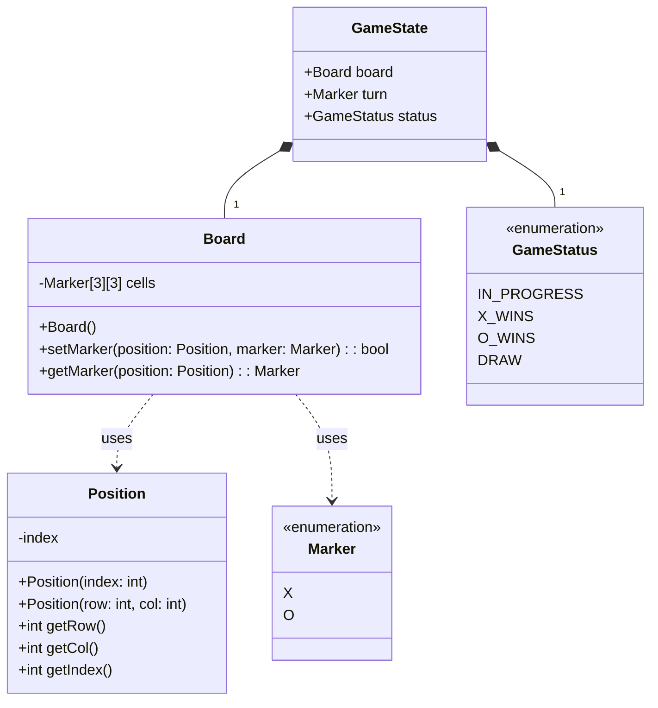
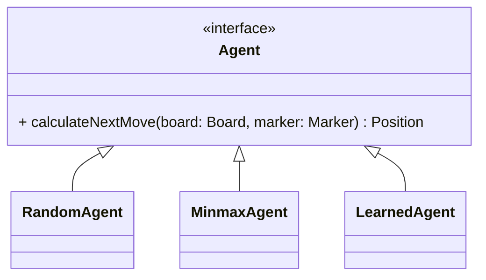
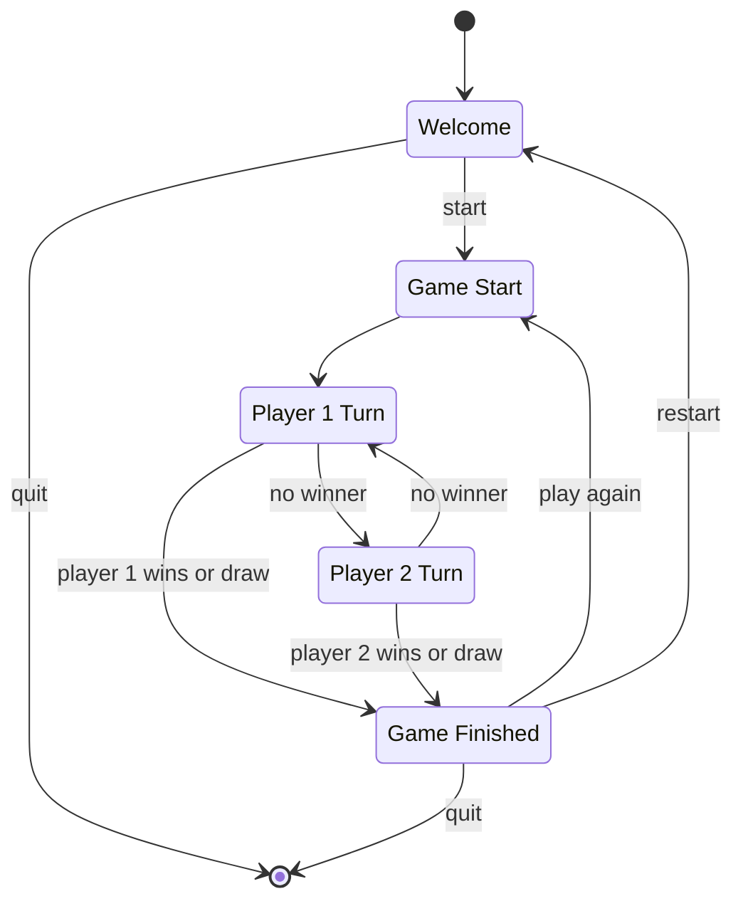
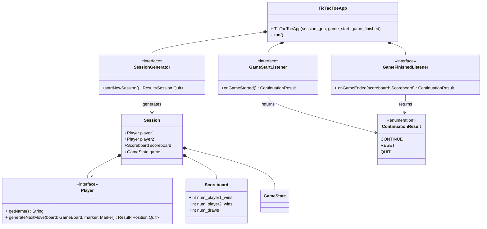

# Tic-Tac-Toe Game: Reference Architecture

> A clean-architecture approach to the classic game, demonstrating separation of concerns across domain, application, and presentation layers.

---

## High-Level Design

The architecture follows a **layered dependency model** where outer layers depend on inner layers, but never the reverse. This ensures the core game logic remains portable and testable independent of any UI framework.

| Layer | Responsibility |
|-------|----------------|
| **Domain** | Pure game logic: rules, state, and AI agents |
| **Application** | Session lifecycle, stage transitions, player coordination |
| **Presentation** | User interface rendering and input handling |



**Key principle:** The domain layer has *zero dependencies* on application or presentation concerns. This allows the same game engine to power a terminal UI, web interface, or automated test harness.

---

## Domain Layer Design

The domain layer encapsulates everything intrinsic to tic-tac-toe itself—the board, markers, win conditions, and move validation. Nothing here knows about users, sessions, or screens.

### Data Model

The core data structures are **immutable value types** designed for clarity and safety. State transitions produce new instances rather than mutating existing ones.



### Agent Classes

AI opponents implement a common `Agent` interface, enabling easy substitution of strategies. The interface takes only the current board state—agents are stateless and deterministic (given the same board, they produce the same move).

| Agent | Strategy | Difficulty |
|-------|----------|------------|
| `RandomAgent` | Selects any open cell at random | Trivial |
| `MinmaxAgent` | Optimal play via minimax search | Unbeatable |
| `LearnedAgent` | ML-trained policy | Configurable |



### Game Logic

Each turn follows a simple **validate → apply → evaluate** pipeline. The function returns a `Result` type—either a new game state on success, or an error describing why the move was rejected.

```python
def takeTurn(state: GameState, position: Position, marker: Marker) -> MoveResult:
    if isValid(state.board, position, marker):
        new_board = state.board.withMove(position, marker)
        new_status = checkStatus(new_board)
        return GameState(new_board, new_status)
    else:
        return Error("Invalid move")
```

> **Note:** `withMove()` returns a *new* board instance. The original remains unchanged, supporting undo/redo and AI lookahead without defensive copying.

### Game Rules

Rules are pure functions with no side effects—given the same inputs, they always produce the same outputs.

#### Move Validation

A move is valid if and only if the target cell exists and is unoccupied:

```python
def isValidMove(board: Board, position: Position, marker: Marker) -> bool:
    return board.isPositionWithinBounds(position) and board.isEmpty(position)
```

#### Status Evaluation

After each move, the board is checked for terminal conditions. Turn order is derived from marker counts (X always moves first):

```python
def checkGameStatus(board: Board) -> GameStatus:
    if hasThreeInARow(Marker::X):
        return GameStatus::X_WINS
    elif hasThreeInARow(Marker::O):
        return GameStatus::O_WINS
    elif board.isFull():
        return GameStatus::DRAW
    elif board.count(Marker::X) > board.count(Marker::O):
        return GameStatus::O_TURN
    else:
        return GameStatus::X_TURN
```

---

## Application Layer Design

The application layer orchestrates *how* the game is played—managing sessions, coordinating players, and handling user-initiated transitions like "quit" or "play again." It depends on the domain layer but knows nothing about rendering.

### Stage Transition Diagram

The application operates as a **finite state machine** with five stages. Each stage represents a distinct point in the user journey with well-defined entry conditions and exit transitions.

| Stage | Description | Exits |
|-------|-------------|-------|
| **Welcome** | Player setup (names, AI selection) | → Start, → Quit |
| **Game Start** | Initializes a fresh board | → Player 1 Turn |
| **Player 1 Turn** | Awaits X's move | → Player 2 Turn, → Game Finished |
| **Player 2 Turn** | Awaits O's move | → Player 1 Turn, → Game Finished |
| **Game Finished** | Displays outcome, updates scoreboard | → Start, → Welcome, → Quit |  




### Application Class Diagram

The application core uses **dependency injection** to remain decoupled from specific UI implementations. Interfaces like `SessionGenerator` and `Player` are implemented by the presentation layer, allowing the same application logic to drive different frontends.



#### Interface Contracts

| Interface | Purpose | Returns |
|-----------|---------|---------|
| `SessionGenerator` | Collects player configuration from the UI | `Result<Session, Quit>` |
| `Player` | Abstracts human input or AI computation | `Result<Position, Quit>` |
| `GameStartListener` | Hook for "new game" animations/sounds | `ContinuationResult` |
| `GameFinishedListener` | Hook for victory screens, stats updates | `ContinuationResult` |

> **Design note:** The `Result<T, Quit>` return type allows any interaction point to cleanly signal that the user wants to exit, without exceptions or global state.

---

## Summary

This architecture prioritizes **testability** and **portability** over brevity. The domain layer can be unit-tested without any UI. The application layer can be tested with mock players. And the presentation layer—whether ncurses, Qt, or a web frontend—simply implements a handful of interfaces to plug into the existing game engine.
