# Tic-Tac-Toe Game: Reference Architecture

**Version:** 1.0
**Status:** Final
**Last Updated:** 2026-01-17
**Author:** Engineering Team

---

## Table of Contents

1. [Executive Summary](#executive-summary)
2. [Architecture Overview](#architecture-overview)
3. [Core Components](#core-components)
4. [System Architecture](#system-architecture)
5. [Data Models](#data-models)
6. [Game Flow](#game-flow)
7. [Interface Specifications](#interface-specifications)
8. [State Management](#state-management)
9. [Win Detection Algorithm](#win-detection-algorithm)
10. [Input/Output Specifications](#inputoutput-specifications)
11. [Error Handling](#error-handling)
12. [Testing Strategy](#testing-strategy)
13. [Implementation Guidelines](#implementation-guidelines)
14. [Language-Specific Considerations](#language-specific-considerations)
15. [Appendices](#appendices)

---

## Executive Summary

### Purpose

This document defines the reference architecture for Tic-Tac-Toe game implementations across multiple programming languages. It establishes a consistent design pattern that ensures all implementations share the same architectural foundation while allowing language-specific idioms and best practices.

The architecture separates concerns into distinct components: game state management, player interaction, display rendering, and game logic. This separation enables flexibility in implementation approaches (console, GUI, web, AI players) while maintaining a common core design.

### Scope

**Included:**
- Core game logic and state management
- Board representation and manipulation
- Player input abstraction (human and AI)
- Display rendering abstraction
- Win detection algorithms
- Game session management with score tracking
- Error handling patterns
- Testing requirements

**Excluded:**
- Specific UI frameworks or rendering technologies
- Network multiplayer functionality
- Persistence/storage mechanisms
- Advanced AI algorithms (though the interface supports them)
- Undo/redo functionality
- Game variations (e.g., larger boards, different win conditions)

### Goals

1. **Consistency:** Ensure all language implementations follow the same architectural patterns
2. **Extensibility:** Support multiple input sources (human, AI) and output targets (console, GUI, web)
3. **Testability:** Enable comprehensive unit and integration testing
4. **Clarity:** Provide clear separation of concerns and well-defined component responsibilities
5. **Maintainability:** Create self-documenting code through strong type systems and interfaces
6. **Flexibility:** Allow implementations in any programming language while maintaining architectural integrity

---

## Architecture Overview

### High-Level Architecture

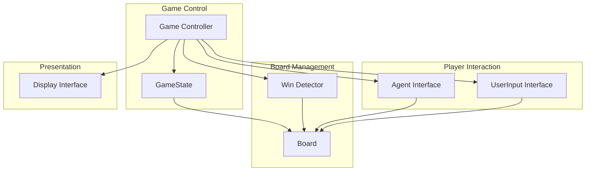

### Design Principles

#### 1. Interface Segregation
Separate interfaces for different concerns (Agent, UserInput, Display) allow implementations to vary independently. A console application and web application can share the same game logic while using different display implementations.

#### 2. Dependency Inversion
The Game Controller depends on abstractions (interfaces) rather than concrete implementations. This allows plugging in different input sources and output targets without modifying core game logic.

#### 3. Single Responsibility
Each component has one clear purpose:
- **Board:** Manages grid state and provides move validation
- **GameState:** Tracks complete game state including score tallies
- **Agent:** Provides move selection logic
- **UserInput:** Handles user interaction for move input
- **Display:** Renders game state to the user

#### 4. Immutability Where Possible
Board states should be queryable without side effects. State changes occur through explicit methods that return success/failure.

#### 5. Fail-Fast Validation
Invalid moves are detected and rejected immediately at the Board level, preventing invalid state.

---

## Core Components

### Static Design: Class Diagram

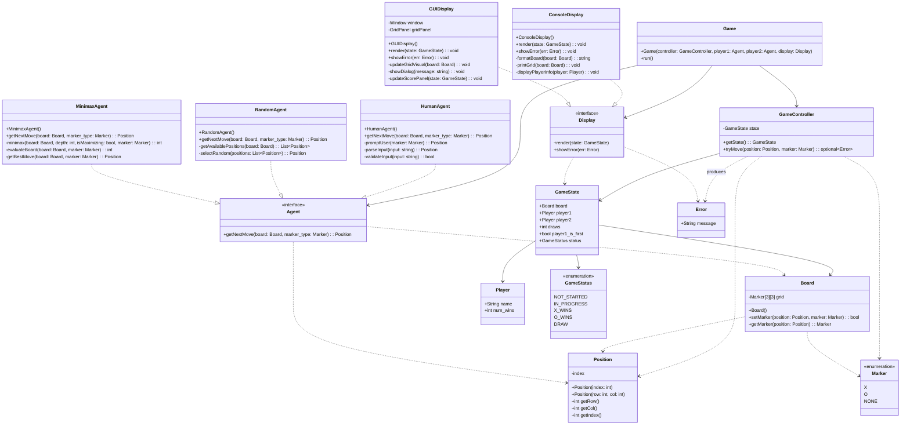

### Component Descriptions

#### Board

**Responsibility:** Manages the 3x3 grid state and provides atomic operations for querying and modifying the board.

**Key Operations:**
- `makeMove(row, col, player)`: Attempts to place a player's mark at the specified position. Returns true if successful, false if the position is invalid or occupied.
- `getCell(row, col)`: Returns the player occupying the cell, or Player.NONE if empty.
- `isFull()`: Checks if all cells are occupied.
- `isEmpty(row, col)`: Checks if a specific cell is available.
- `clear()`: Resets all cells to empty state.
- `clone()`: Creates a deep copy of the board (useful for AI lookahead).

**Invariants:**
- Grid is always 3x3
- Each cell contains either Player.X, Player.O, or Player.NONE
- Once set, a cell can only be cleared, not overwritten

#### GameState

**Responsibility:** Maintains complete game state including the current board, turn information, and cumulative score across multiple rounds.

**Key Properties:**
- `board`: Current board state
- `currentPlayer`: Whose turn it is (Player.X or Player.O)
- `xWins`: Number of rounds won by X
- `oWins`: Number of rounds won by O
- `draws`: Number of draw rounds
- `status`: Current game status (NOT_STARTED, IN_PROGRESS, X_WINS, O_WINS, DRAW)

**Key Operations:**
- `switchPlayer()`: Toggles between X and O
- `recordWin(player)`: Increments win counter for the specified player
- `recordDraw()`: Increments draw counter
- `resetRound()`: Clears the board and sets status to NOT_STARTED, preserving score tallies
- `resetAll()`: Resets board, status, and all score tallies

**Lifecycle:**
- Created in NOT_STARTED state
- Transitions to IN_PROGRESS on first move
- Transitions to X_WINS/O_WINS/DRAW when round ends
- Returns to NOT_STARTED when round is reset

#### Agent Interface

**Responsibility:** Provides an abstraction for any entity that can select moves (human via UserInput, or AI algorithms).

**Key Method:**
- `getNextMove(board, player)`: Given the current board state and the player to move, returns a Move object indicating the desired row and column.

**Implementation Notes:**
- AI agents can implement sophisticated algorithms (minimax, neural networks, etc.)
- Human player agents delegate to UserInput interface
- Agents receive a read-only view of the board
- Agents must return valid moves (implementations should validate)

#### UserInput Interface

**Responsibility:** Abstracts the mechanism for obtaining move input from a human user.

**Key Method:**
- `getNextMove(board, player)`: Prompts the user and returns their selected move.

**Implementation Variations:**
- Console: Parse text input like "1 2" or "A1"
- GUI: Handle mouse clicks on board cells
- Web: Process HTTP requests or WebSocket messages
- Touch: Process touch events on mobile devices

**Error Handling:**
- Implementations should re-prompt on invalid input
- Should display helpful error messages
- May show current board state as context

#### Display Interface

**Responsibility:** Renders game state and messages to the user.

**Key Methods:**
- `showBoard(gameState)`: Renders current board and game information
- `showWinner(player)`: Announces the winner
- `showDraw()`: Announces a draw
- `showScore(gameState)`: Displays cumulative scores
- `showError(message)`: Displays error messages
- `showInvalidMove()`: Notifies user of invalid move attempt

**Implementation Variations:**
- Console: ASCII art grid, text messages
- GUI: Graphical grid with images/colors, dialog boxes
- Web: HTML rendering, dynamic updates
- Audio: Speech synthesis for accessibility

#### GameController

**Responsibility:** Orchestrates the game flow, coordinates between components, and enforces game rules.

**Key Operations:**
- `setXPlayer(agent)`: Configure the agent for Player X
- `setOPlayer(agent)`: Configure the agent for Player O
- `setUserInput(input)`: Configure user input mechanism
- `playGame()`: Run a complete game session (multiple rounds)
- `playRound()`: Execute a single round until win/draw
- `processMove(move)`: Validate and apply a move to the game state
- `checkGameEnd()`: Evaluate win/draw conditions

**Control Flow:**
1. Initialize GameState and Display
2. Configure players (X and O agents)
3. Start round
4. Loop: Get move from current player's agent, apply move, check end condition, switch player
5. Display result and update scores
6. Optionally start new round

---

## System Architecture

### Layered Architecture

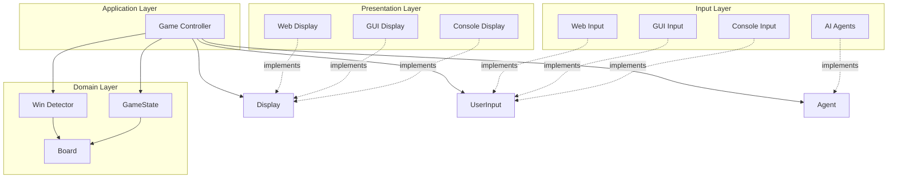

### Layer Responsibilities

#### Presentation Layer
- **Responsibility:** Rendering game state to users
- **Components:** Display interface implementations
- **Dependencies:** Read-only access to GameState
- **Examples:** ConsoleDisplay, GUIDisplay, WebDisplay

#### Input Layer
- **Responsibility:** Capturing user actions and AI decisions
- **Components:** UserInput and Agent interface implementations
- **Dependencies:** Read-only access to Board
- **Examples:** ConsoleInput, GUIClickHandler, MinimaxAgent, RandomAgent

#### Application Layer
- **Responsibility:** Game flow orchestration and rule enforcement
- **Components:** GameController
- **Dependencies:** All interfaces (Display, Agent, UserInput) and GameState
- **Role:** Mediates between domain logic and presentation/input

#### Domain Layer
- **Responsibility:** Core game logic, rules, and state
- **Components:** GameState, Board, Win Detector
- **Dependencies:** None (self-contained)
- **Characteristics:** Framework-agnostic, pure logic

---

## Data Models

### Board State Model

The Board represents the 3x3 playing grid as a two-dimensional array of Cells.

**Structure:**
```
grid[row][col] where 0 <= row, col <= 2

grid[0][0] | grid[0][1] | grid[0][2]
-----------|------------|------------
grid[1][0] | grid[1][1] | grid[1][2]
-----------|------------|------------
grid[2][0] | grid[2][1] | grid[2][2]
```

**Cell States:**
- `Player.NONE`: Empty cell
- `Player.X`: Occupied by X
- `Player.O`: Occupied by O

**Coordinate System:**
- Rows: 0 (top) to 2 (bottom)
- Columns: 0 (left) to 2 (right)
- Cell (0,0) is top-left
- Cell (2,2) is bottom-right

**Operations:**
- Read operations: O(1)
- Write operations: O(1)
- Full board check: O(1) with flag or O(9) with iteration
- Clone: O(9)

### Player Model

Player is an enumeration representing the three possible cell states:

```
enum Player {
    X,      // First player (traditionally goes first)
    O,      // Second player
    NONE    // Empty cell / no winner
}
```

**Properties:**
- Each player has an associated symbol (typically "X" and "O")
- NONE represents absence of a player
- Players alternate turns (X → O → X → ...)

### GameState Model

GameState encapsulates the complete game state including board, turn, scores, and status.

**Properties:**

| Property | Type | Description |
|----------|------|-------------|
| board | Board | Current board state |
| currentPlayer | Player | Whose turn it is (X or O) |
| xWins | int | Number of rounds won by X |
| oWins | int | Number of rounds won by O |
| draws | int | Number of draw rounds |
| status | GameStatus | Current game status |

**GameStatus Enumeration:**
- `NOT_STARTED`: Initial state, no moves made
- `IN_PROGRESS`: Game is active
- `X_WINS`: X has won the current round
- `O_WINS`: O has won the current round
- `DRAW`: Board is full with no winner

**State Transitions:**
```
NOT_STARTED → IN_PROGRESS (on first move)
IN_PROGRESS → X_WINS (X wins)
IN_PROGRESS → O_WINS (O wins)
IN_PROGRESS → DRAW (board full, no winner)
{X_WINS, O_WINS, DRAW} → NOT_STARTED (on reset round)
```

### Data Structure Requirements

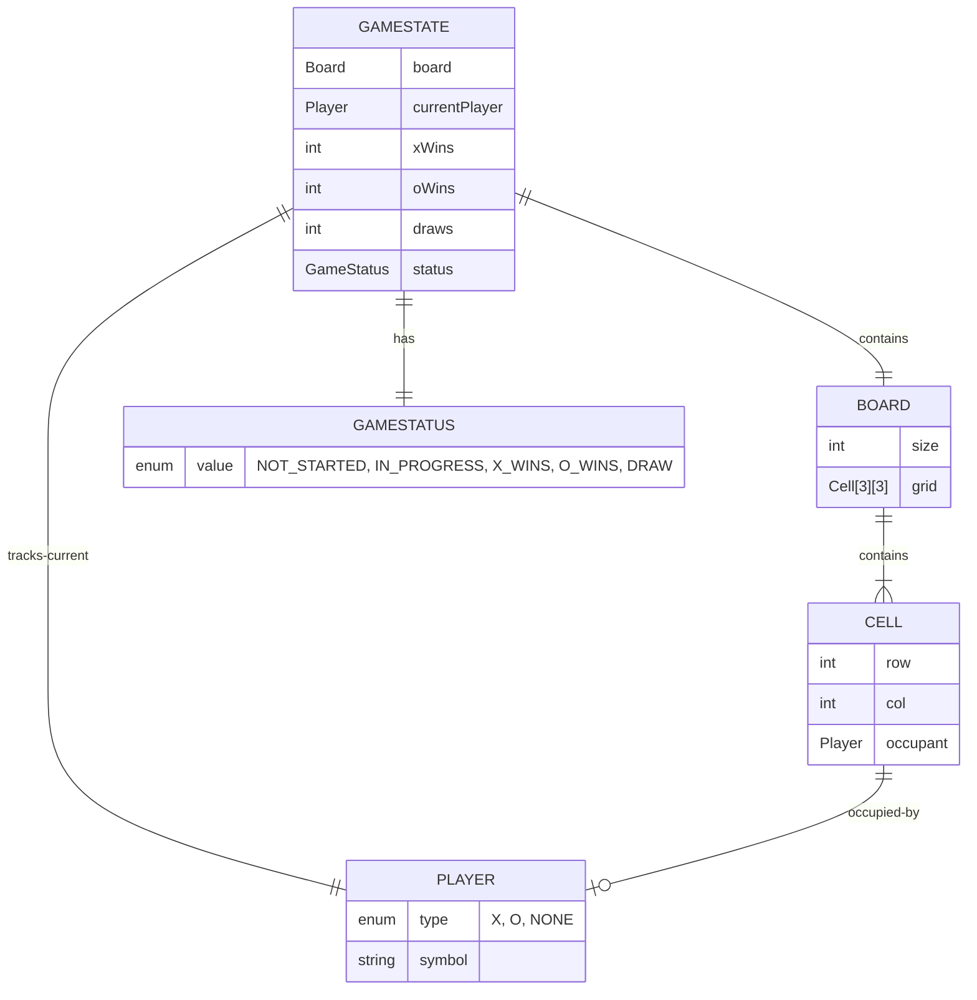

---

## Game Flow

### Main Game Loop

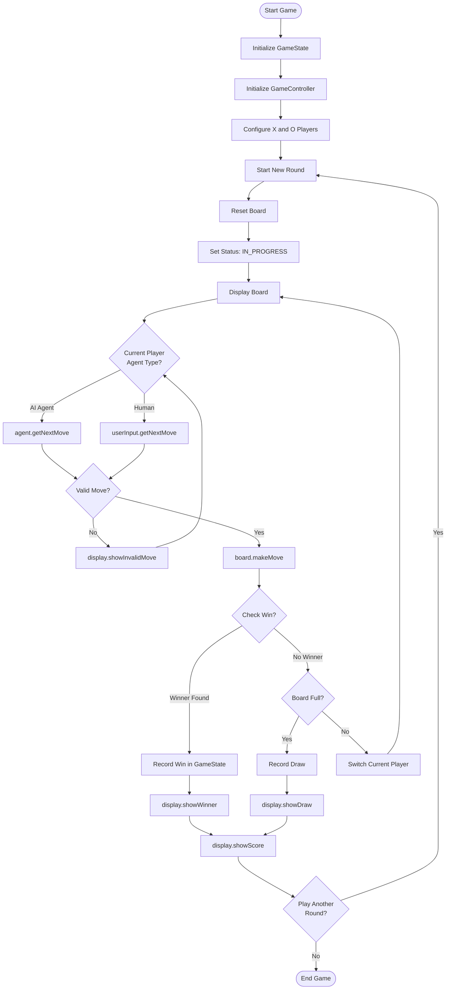

### Dynamic Design: Sequence Diagrams

#### Sequence 1: Starting a Game

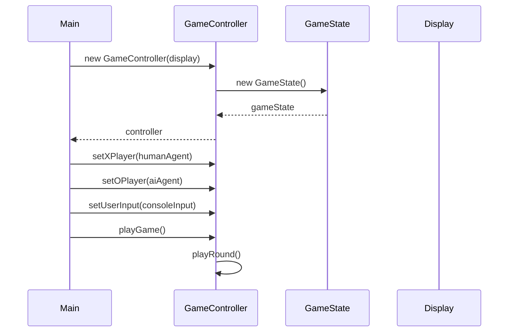

#### Sequence 2: Human Player Makes a Move

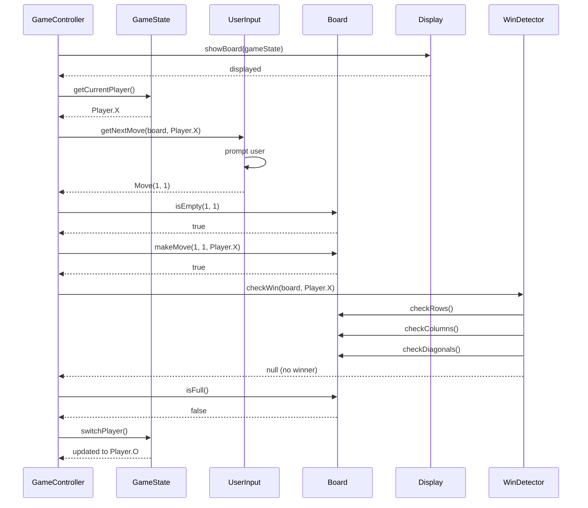

#### Sequence 3: AI Player Makes a Move

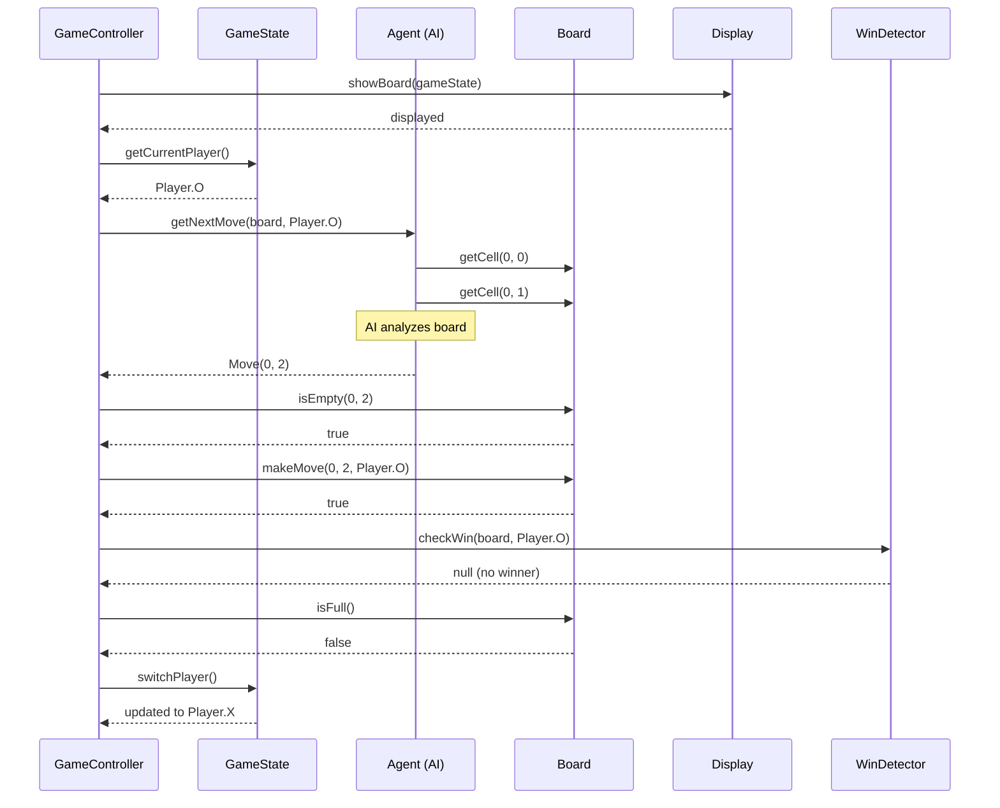

#### Sequence 4: Game Ends with Winner

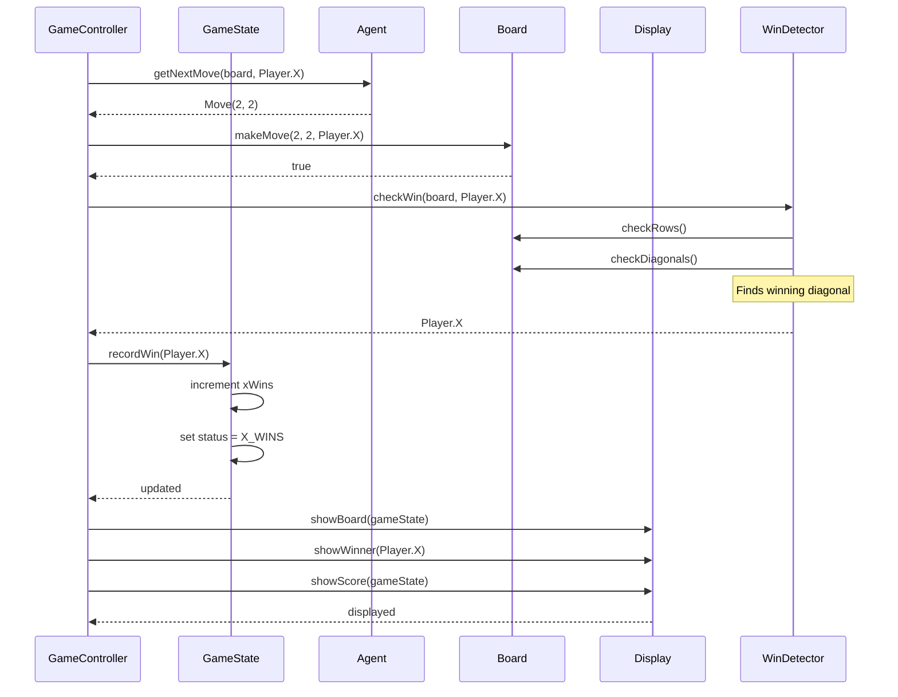

#### Sequence 5: Invalid Move Handling

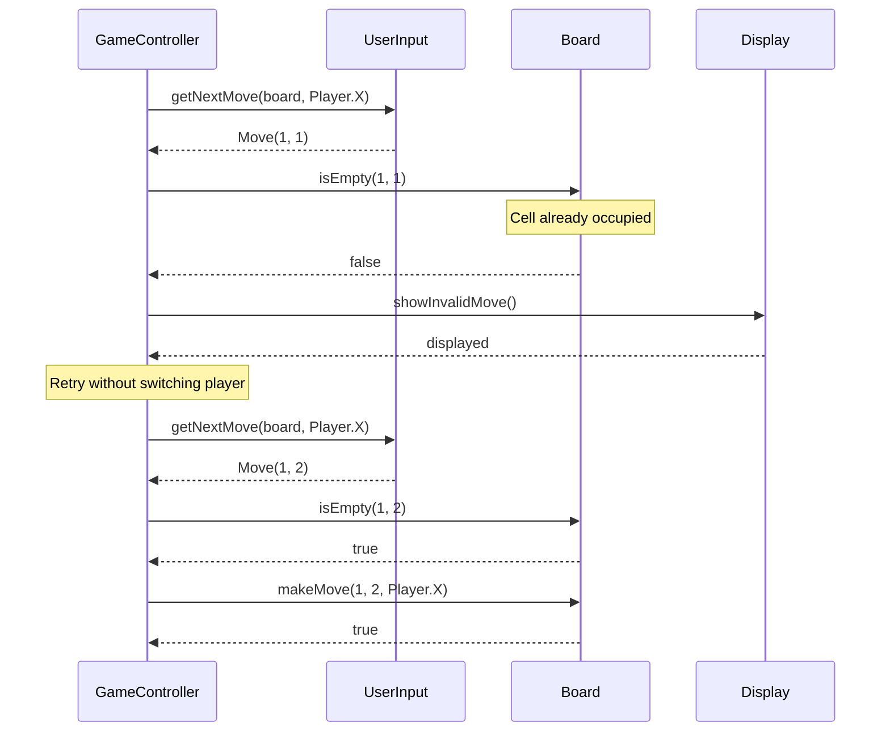

---

## Interface Specifications

### Agent Interface

**Purpose:** Abstraction for any move-selection strategy (human or AI).

**Method Signature:**
```
getNextMove(board: Board, player: Player): Move
```

**Parameters:**
- `board`: Read-only view of current board state
- `player`: The player (X or O) for whom to select a move

**Returns:**
- `Move` object with row and column

**Contract:**
- Must return a valid move (within bounds, unoccupied cell)
- Should not modify the board
- May take arbitrary time for computation
- Implementations should handle all edge cases internally

**Common Implementations:**
- `HumanAgent`: Delegates to UserInput interface
- `RandomAgent`: Selects random available cell
- `MinimaxAgent`: Uses minimax algorithm for optimal play
- `NeuralNetAgent`: Uses trained neural network

### UserInput Interface

**Purpose:** Abstraction for obtaining move input from human users.

**Method Signature:**
```
getNextMove(board: Board, player: Player): Move
```

**Parameters:**
- `board`: Read-only board state (for context/validation)
- `player`: The player making the move

**Returns:**
- `Move` object representing user's selection

**Contract:**
- Must prompt user for input
- Should validate input before returning
- Should re-prompt on invalid input
- May display board as context
- Should provide clear error messages

**Common Implementations:**
- `ConsoleInput`: Parse text input (e.g., "1 2", "B2")
- `GUIInput`: Handle mouse clicks on grid
- `TouchInput`: Process touch events
- `WebInput`: Handle HTTP/WebSocket messages

**Example Interaction Flow:**
```
1. Display prompt: "Player X, enter your move (row col): "
2. Read user input: "1 2"
3. Parse input: row=1, col=2
4. Validate: Check if within bounds and cell is empty
5. Return: Move(1, 2)
6. If invalid, display error and return to step 1
```

### Display Interface

**Purpose:** Abstraction for rendering game state and messages.

**Method Signatures:**

```
showBoard(gameState: GameState): void
```
- Renders current board with all marks
- May also show current player, score, etc.

```
showWinner(player: Player): void
```
- Announces the winning player
- Typically includes celebratory message

```
showDraw(): void
```
- Announces a draw/tie game

```
showScore(gameState: GameState): void
```
- Displays cumulative scores (X wins, O wins, draws)

```
showError(message: string): void
```
- Displays error message to user

```
showInvalidMove(): void
```
- Notifies user that their move was invalid
- Should explain why (occupied, out of bounds, etc.)

**Contract:**
- Methods should not block indefinitely
- Should be safe to call multiple times
- Should handle null/invalid input gracefully
- No return values (fire-and-forget rendering)

**Common Implementations:**
- `ConsoleDisplay`: ASCII art, text messages
- `GUIDisplay`: Graphical grid, dialog boxes
- `WebDisplay`: HTML/Canvas rendering
- `SpeechDisplay`: Audio announcements for accessibility

---

## State Management

### State Transitions

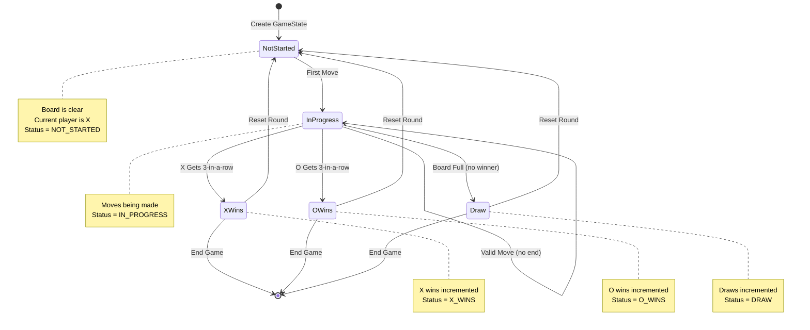

### State Definitions

#### NOT_STARTED
- **Characteristics:**
  - Board is empty (all cells are Player.NONE)
  - Current player is Player.X
  - No moves have been made
- **Transitions:**
  - → IN_PROGRESS on first successful move

#### IN_PROGRESS
- **Characteristics:**
  - At least one move has been made
  - Game has no winner yet
  - Board has at least one empty cell
- **Transitions:**
  - → IN_PROGRESS on successful move (no end condition)
  - → X_WINS when X achieves 3-in-a-row
  - → O_WINS when O achieves 3-in-a-row
  - → DRAW when board fills with no winner

#### X_WINS
- **Characteristics:**
  - X has three marks in a row (horizontal, vertical, or diagonal)
  - xWins counter has been incremented
  - No further moves accepted
- **Transitions:**
  - → NOT_STARTED on resetRound()
  - → [End] on game termination

#### O_WINS
- **Characteristics:**
  - O has three marks in a row (horizontal, vertical, or diagonal)
  - oWins counter has been incremented
  - No further moves accepted
- **Transitions:**
  - → NOT_STARTED on resetRound()
  - → [End] on game termination

#### DRAW
- **Characteristics:**
  - All 9 cells are occupied
  - No player has 3-in-a-row
  - draws counter has been incremented
- **Transitions:**
  - → NOT_STARTED on resetRound()
  - → [End] on game termination

### State Invariants

1. **Current Player:** Always Player.X or Player.O (never Player.NONE)
2. **Score Consistency:** xWins + oWins + draws = total completed rounds
3. **Board-Status Alignment:**
   - NOT_STARTED → board is empty
   - IN_PROGRESS → board has moves but no winner
   - X_WINS/O_WINS → board has a winning line
   - DRAW → board is full with no winner
4. **Turn Ordering:** Players alternate (X always starts)

---

## Win Detection Algorithm

### Win Conditions

A player wins when they have three of their marks in any of these patterns:

**Rows (3 conditions):**
```
[0,0] [0,1] [0,2]  ← Row 0
[1,0] [1,1] [1,2]  ← Row 1
[2,0] [2,1] [2,2]  ← Row 2
```

**Columns (3 conditions):**
```
[0,0]  [0,1]  [0,2]
  ↓      ↓      ↓
[1,0]  [1,1]  [1,2]
  ↓      ↓      ↓
[2,0]  [2,1]  [2,2]

Col 0  Col 1  Col 2
```

**Diagonals (2 conditions):**
```
[0,0]    ↘    [0,2]
   ↘           ↙
  [1,1]     [1,1]
     ↘     ↙
    [2,2] [2,0]

Diagonal 1  Diagonal 2
(top-left)  (top-right)
```

**Total:** 8 possible winning patterns

### Algorithm Specification

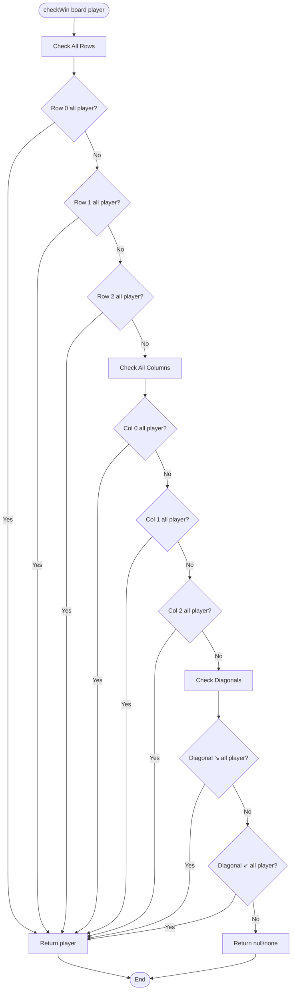

### Pseudocode

```
function checkWin(board: Board, player: Player): Player or null
    // Check rows
    for row from 0 to 2:
        if board[row][0] == player AND
           board[row][1] == player AND
           board[row][2] == player:
            return player

    // Check columns
    for col from 0 to 2:
        if board[0][col] == player AND
           board[1][col] == player AND
           board[2][col] == player:
            return player

    // Check diagonal (top-left to bottom-right)
    if board[0][0] == player AND
       board[1][1] == player AND
       board[2][2] == player:
        return player

    // Check diagonal (top-right to bottom-left)
    if board[0][2] == player AND
       board[1][1] == player AND
       board[2][0] == player:
        return player

    // No winner
    return null
```

### Performance Requirements

- **Time Complexity:** O(1) - Always check exactly 8 patterns
- **Space Complexity:** O(1) - No additional data structures needed
- **Maximum Operations:** 24 cell comparisons (3 cells × 8 patterns)
- **Early Exit:** Should return immediately upon finding a win
- **Frequency:** Called after every move

### Optimization Considerations

1. **Last Move Optimization:** Only check patterns involving the last move's position
2. **Incremental Win Tracking:** Maintain counters for each pattern, update on each move
3. **Bit Manipulation:** Use bitboards for ultra-fast win detection (advanced)

**Trade-offs:**
- Simple approach (check all 8) is easiest to understand and maintain
- Optimizations add complexity for minimal performance gain on a 3×3 board
- Recommended: Use simple approach unless profiling shows bottleneck

---

## Input/Output Specifications

### Input Validation Rules

#### Move Input Validation

**Rule 1: Coordinate Range**
- Row must be in range [0, 2]
- Column must be in range [0, 2]
- **Error:** "Move out of bounds"

**Rule 2: Cell Availability**
- Target cell must be empty (Player.NONE)
- **Error:** "Cell already occupied"

**Rule 3: Game State**
- Game must be in IN_PROGRESS status
- **Error:** "Game is not in progress"

**Rule 4: Turn Validation**
- Move must be for the current player
- **Error:** "Not your turn"

#### Input Parsing (for text-based input)

**Accepted Formats:**
- "row col" (e.g., "0 0", "1 2", "2 1")
- "row,col" (e.g., "0,0", "1,2")
- "A1" notation (A-C for row, 1-3 for column)

**Invalid Input Handling:**
- Non-numeric characters (except in notation like "A1")
- Negative numbers
- Missing parameters
- Extra parameters
- **Error:** "Invalid input format"

### Output Formatting Standards

#### Board Display Format

**ASCII Console Format:**
```
   0   1   2
0  X | O | X
  -----------
1    | X | O
  -----------
2  O |   |
```

**Compact Format:**
```
X O X
  X O
O
```

**With Status:**
```
   0   1   2
0  X | O | X
  -----------
1    | X | O
  -----------
2  O |   |

Current Player: O
Score - X: 2  O: 1  Draws: 0
```

#### Message Formatting

**Winner Announcement:**
```
================================
       PLAYER X WINS!
================================
```

**Draw Announcement:**
```
================================
        GAME DRAW!
================================
```

**Score Display:**
```
=== SCORE ===
X Wins:   3
O Wins:   2
Draws:    1
==============
```

### Error Messages

| Error Condition | Message | Suggested Action |
|----------------|---------|------------------|
| Out of bounds | "Move out of bounds. Please enter row and column between 0 and 2." | Re-prompt for input |
| Cell occupied | "Cell already occupied. Please choose an empty cell." | Re-prompt for input |
| Invalid format | "Invalid input format. Please enter: row col (e.g., '1 2')" | Re-prompt for input |
| Game not started | "Game has not started yet." | Start new game |
| Game ended | "Game has ended. Start a new round to continue." | Offer round reset |
| Internal error | "Internal error occurred. Please restart the game." | Log error, restart |

**Error Message Principles:**
1. **Clear:** Explain what went wrong
2. **Actionable:** Tell user what to do next
3. **Consistent:** Use same format for similar errors
4. **Friendly:** Avoid technical jargon
5. **Helpful:** Provide examples when applicable

---

## Error Handling

### Error Categories

#### 1. Input Errors
**Cause:** Invalid user input or move selection

**Examples:**
- Out-of-bounds coordinates
- Occupied cell selection
- Malformed input string
- Non-numeric input

**Handling:**
- Validate input immediately
- Display clear error message
- Re-prompt for valid input
- Do not change game state
- Log for debugging (optional)

#### 2. State Errors
**Cause:** Attempting operations in invalid game states

**Examples:**
- Making move when game is ended
- Switching player when not in progress
- Resetting non-existent game

**Handling:**
- Check state before operations
- Throw exception or return error code
- Display state-specific message
- Suggest correct action

#### 3. Configuration Errors
**Cause:** Invalid game setup or initialization

**Examples:**
- Missing Agent configuration
- Missing UserInput configuration
- Missing Display implementation
- Null references

**Handling:**
- Validate configuration at startup
- Fail fast with descriptive error
- Provide configuration checklist
- Use default implementations if possible

#### 4. Logic Errors
**Cause:** Internal programming errors or bugs

**Examples:**
- Win detector false positive/negative
- State transition violation
- Invariant violation

**Handling:**
- Use assertions in development
- Log detailed diagnostic information
- Fail fast to prevent corruption
- Include stack traces for debugging

### Error Handling Strategy

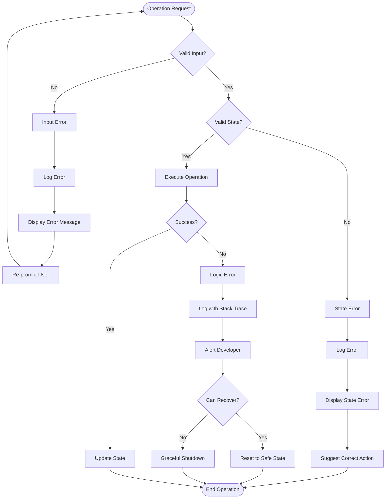

### Exception Hierarchy (for languages with exceptions)

```
GameException
├── InvalidMoveException
│   ├── OutOfBoundsException
│   ├── CellOccupiedException
│   └── InvalidInputException
├── InvalidStateException
│   ├── GameNotStartedException
│   ├── GameEndedException
│   └── StateTransitionException
└── ConfigurationException
    ├── MissingAgentException
    ├── MissingInputException
    └── MissingDisplayException
```

### Retry and Recovery

**Retry Strategies:**
1. **Input Errors:** Always retry (user can correct)
2. **State Errors:** Suggest state reset, offer retry
3. **Configuration Errors:** No retry (must fix configuration)
4. **Logic Errors:** No retry (requires code fix)

**Recovery Strategies:**
1. **Preserve Scores:** Keep win/loss/draw tallies even on error
2. **Board Reset:** Clear board on unrecoverable error
3. **State Reset:** Return to NOT_STARTED state
4. **Full Reset:** Last resort, clear all state

---

## Testing Strategy

### Test Coverage Requirements

**Minimum Coverage Targets:**
- **Board Class:** 100% (critical component)
- **GameState Class:** 100% (state management is critical)
- **Win Detector:** 100% (correctness is essential)
- **Game Controller:** 90% (complex orchestration)
- **Interface Implementations:** 80% (UI variations)

**Overall Target:** 90% code coverage

### Unit Testing

#### Board Class Tests

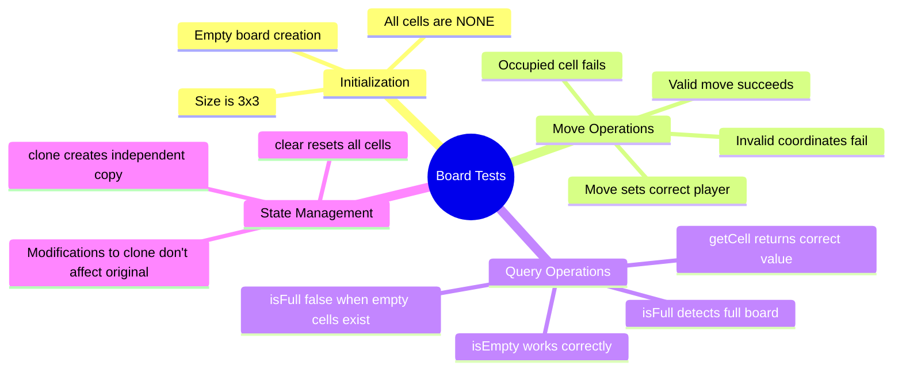

**Example Test Cases:**
```
testBoardInitialization()
  - Create new board
  - Assert all cells are Player.NONE
  - Assert isFull() returns false

testValidMove()
  - Create board
  - makeMove(0, 0, Player.X)
  - Assert returns true
  - Assert getCell(0, 0) == Player.X

testInvalidMove_OutOfBounds()
  - Create board
  - makeMove(-1, 0, Player.X)
  - Assert returns false

testInvalidMove_OccupiedCell()
  - Create board
  - makeMove(0, 0, Player.X) succeeds
  - makeMove(0, 0, Player.O) fails
  - Assert getCell(0, 0) == Player.X (unchanged)

testBoardFull()
  - Fill all 9 cells
  - Assert isFull() returns true

testBoardClone()
  - Create board, make some moves
  - Clone board
  - Modify clone
  - Assert original unchanged
```

#### GameState Class Tests

**Test Categories:**
1. **Initialization:** Correct default values
2. **Player Switching:** Alternates correctly
3. **Score Tracking:** Increments accurately
4. **Status Transitions:** Correct state changes
5. **Reset Operations:** Clear state appropriately

**Example Test Cases:**
```
testInitialState()
  - Create GameState
  - Assert currentPlayer == Player.X
  - Assert status == NOT_STARTED
  - Assert all scores == 0

testSwitchPlayer()
  - Create GameState
  - Assert currentPlayer == Player.X
  - switchPlayer()
  - Assert currentPlayer == Player.O
  - switchPlayer()
  - Assert currentPlayer == Player.X

testRecordWin()
  - Create GameState
  - recordWin(Player.X)
  - Assert xWins == 1
  - Assert status == X_WINS

testResetRound()
  - Create GameState with moves and scores
  - resetRound()
  - Assert board is empty
  - Assert status == NOT_STARTED
  - Assert scores unchanged
```

#### Win Detector Tests

**Critical Test Cases (must all pass):**

```
testRowWin_Row0() through testRowWin_Row2()
  - Set up winning row for each row (0, 1, 2)
  - Assert checkWin returns correct player

testColumnWin_Col0() through testColumnWin_Col2()
  - Set up winning column for each column (0, 1, 2)
  - Assert checkWin returns correct player

testDiagonalWin_TopLeftBottomRight()
  - Set [0,0], [1,1], [2,2] to same player
  - Assert checkWin returns player

testDiagonalWin_TopRightBottomLeft()
  - Set [0,2], [1,1], [2,0] to same player
  - Assert checkWin returns player

testNoWinner_EmptyBoard()
  - Empty board
  - Assert checkWin returns null

testNoWinner_PartialBoard()
  - Partially filled board, no lines
  - Assert checkWin returns null

testNoWinner_FullBoard_Draw()
  - Full board with no winning lines
  - Assert checkWin returns null
```

### Integration Testing

#### End-to-End Game Flow Tests

**Test Scenario 1: Complete Game to X Win**
```
1. Initialize game with test agents
2. X makes move [0,0]
3. O makes move [1,0]
4. X makes move [0,1]
5. O makes move [1,1]
6. X makes move [0,2]
7. Assert game status == X_WINS
8. Assert X score incremented
```

**Test Scenario 2: Complete Game to Draw**
```
1. Initialize game
2. Play sequence: X[0,0], O[0,1], X[0,2], O[1,1], X[1,0], O[1,2], X[2,1], O[2,0], X[2,2]
3. Assert game status == DRAW
4. Assert draw count incremented
```

**Test Scenario 3: Invalid Move Handling**
```
1. Initialize game
2. X attempts move [0,0] - succeeds
3. O attempts move [0,0] - fails (occupied)
4. Verify O can retry with valid move
5. Verify game continues normally
```

**Test Scenario 4: Multiple Rounds**
```
1. Play complete round to X win
2. Reset round
3. Play complete round to O win
4. Assert X wins == 1, O wins == 1
5. Verify board cleared between rounds
```

### Test Automation

**Continuous Integration:**
- Run all tests on every commit
- Fail build if coverage drops below threshold
- Fail build if any test fails

**Test Organization:**
```
tests/
├── unit/
│   ├── board_test.*
│   ├── gamestate_test.*
│   ├── windetector_test.*
│   └── move_test.*
├── integration/
│   ├── gameplay_test.*
│   ├── controller_test.*
│   └── multiround_test.*
└── mocks/
    ├── mock_agent.*
    ├── mock_input.*
    └── mock_display.*
```

### Test Data and Fixtures

**Common Test Boards:**
```
Empty Board:
. . .
. . .
. . .

X Winning Board (Row 0):
X X X
O O .
. . .

Draw Board:
X O X
X O O
O X X

Near Win Board:
X X .
O O .
. . .
```

---

## Implementation Guidelines

### Naming Conventions

#### Classes and Types
- **PascalCase** for class names: `Board`, `GameState`, `GameController`
- **PascalCase** for enumerations: `Player`, `GameStatus`
- **PascalCase** for interfaces: `Agent`, `UserInput`, `Display`

#### Methods and Functions
- **camelCase** for method names: `makeMove`, `getNextMove`, `checkWin`
- **Verb-based** naming: methods should describe actions
- **Boolean methods** prefixed with `is`, `has`, `can`: `isEmpty`, `isFull`, `hasWinner`

#### Variables
- **camelCase** for variables: `currentPlayer`, `xWins`, `gameState`
- **Descriptive names**: avoid single letters except for loop counters (i, j)
- **Constants in UPPER_SNAKE_CASE** (where applicable): `BOARD_SIZE`, `EMPTY_CELL`

#### Language-Specific Adjustments
- **Python:** snake_case for methods and variables per PEP 8
- **C++:** snake_case or camelCase based on project style guide
- **Java/C#:** PascalCase for types, camelCase for methods/variables

### Code Organization

#### File Structure

**Recommended organization:**
```
tic-tac-toe/
├── src/
│   ├── core/
│   │   ├── Board.*
│   │   ├── GameState.*
│   │   ├── Move.*
│   │   ├── Player.*
│   │   └── GameStatus.*
│   ├── interfaces/
│   │   ├── Agent.*
│   │   ├── UserInput.*
│   │   └── Display.*
│   ├── game/
│   │   ├── GameController.*
│   │   └── WinDetector.*
│   ├── agents/
│   │   ├── HumanAgent.*
│   │   ├── RandomAgent.*
│   │   └── MinimaxAgent.*
│   ├── input/
│   │   ├── ConsoleInput.*
│   │   └── GUIInput.*
│   └── display/
│       ├── ConsoleDisplay.*
│       └── GUIDisplay.*
├── tests/
│   ├── unit/
│   └── integration/
├── docs/
│   └── REFERENCE_ARCHITECTURE.md
└── README.md
```

#### Module Dependencies

**Dependency Rules:**
1. Core modules (Board, GameState) depend on nothing
2. Interfaces depend only on core modules
3. Game logic depends on core and interfaces
4. Implementations depend on interfaces
5. **No circular dependencies**

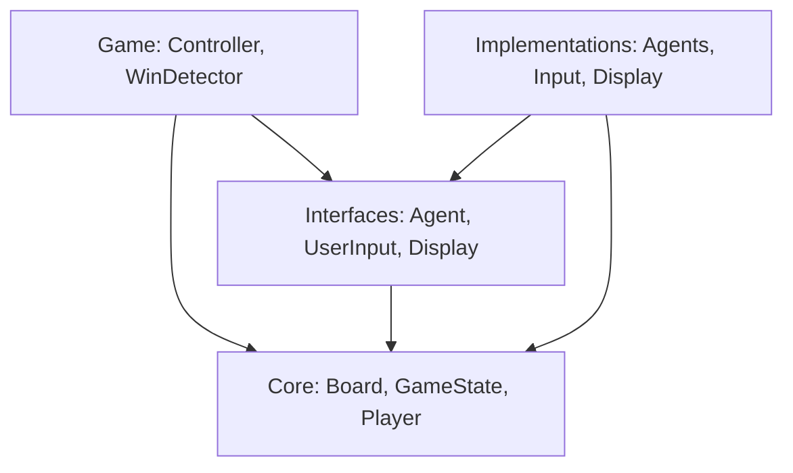

### Documentation Requirements

#### Class Documentation

**Required for every class:**
```
/**
 * Brief description of class purpose
 *
 * Detailed explanation of responsibilities,
 * usage patterns, and important notes.
 *
 * Example usage:
 *   code example here
 */
```

#### Method Documentation

**Required for all public methods:**
```
/**
 * Brief description of what method does
 *
 * @param paramName Description of parameter
 * @return Description of return value
 * @throws ExceptionType When exception is thrown
 */
```

#### Interface Documentation

**Required for all interfaces:**
```
/**
 * Interface description and purpose
 *
 * Contract/guarantees:
 * - List expected behaviors
 * - List constraints
 * - List invariants
 *
 * Common implementations:
 * - Implementation1: Description
 * - Implementation2: Description
 */
```

#### Code Comments

**When to comment:**
- Complex algorithms (e.g., win detection)
- Non-obvious business logic
- Performance optimizations
- Workarounds for bugs/limitations

**When NOT to comment:**
- Self-evident code
- Obvious getters/setters
- Repeated explanations

**Style:**
- Write WHY, not WHAT
- Keep comments up-to-date
- Use complete sentences

---

## Language-Specific Considerations

### C++

**Interface Implementation:**
- Use abstract base classes for interfaces (pure virtual methods)
- Use smart pointers (`std::unique_ptr`, `std::shared_ptr`) for ownership
- Use `const` references for read-only parameters
- Use enum class for strong typing

**Example:**
```cpp
class Agent {
public:
    virtual ~Agent() = default;
    virtual Move getNextMove(const Board& board, Player player) = 0;
};

class Board {
private:
    std::array<std::array<Player, 3>, 3> grid;
public:
    bool makeMove(int row, int col, Player player);
    Player getCell(int row, int col) const;
};
```

**Best Practices:**
- Use RAII for resource management
- Prefer `constexpr` for compile-time constants
- Use `override` keyword for virtual method overrides
- Consider `std::optional` for nullable return values

### Python

**Interface Implementation:**
- Use abstract base classes from `abc` module
- Use type hints (PEP 484) for better clarity
- Use enumerations from `enum` module
- Follow PEP 8 style guide

**Example:**
```python
from abc import ABC, abstractmethod
from typing import Optional
from enum import Enum

class Player(Enum):
    X = "X"
    O = "O"
    NONE = " "

class Agent(ABC):
    @abstractmethod
    def get_next_move(self, board: 'Board', player: Player) -> 'Move':
        pass

class Board:
    def __init__(self):
        self._grid: list[list[Player]] = [[Player.NONE] * 3 for _ in range(3)]

    def make_move(self, row: int, col: int, player: Player) -> bool:
        # Implementation
        pass
```

**Best Practices:**
- Use dataclasses for simple data containers
- Use `__slots__` for memory efficiency if needed
- Prefer composition over inheritance
- Use context managers for resource management

### JavaScript/TypeScript

**TypeScript Recommended** for type safety

**Interface Implementation:**
- Use TypeScript interfaces
- Use classes for concrete types
- Use enums for Player and GameStatus

**Example:**
```typescript
enum Player {
    X = 'X',
    O = 'O',
    NONE = ' '
}

interface Agent {
    getNextMove(board: Board, player: Player): Move;
}

class Board {
    private grid: Player[][];

    constructor() {
        this.grid = Array(3).fill(null).map(() => Array(3).fill(Player.NONE));
    }

    makeMove(row: number, col: number, player: Player): boolean {
        // Implementation
    }
}
```

**Best Practices:**
- Enable strict type checking in tsconfig.json
- Use readonly for immutable properties
- Prefer `const` over `let`
- Use arrow functions to preserve `this` context

### Java

**Interface Implementation:**
- Use interfaces for Agent, UserInput, Display
- Use enums for Player and GameStatus
- Follow JavaBeans conventions for getters/setters

**Example:**
```java
public enum Player {
    X, O, NONE
}

public interface Agent {
    Move getNextMove(Board board, Player player);
}

public class Board {
    private Player[][] grid;

    public Board() {
        grid = new Player[3][3];
        // Initialize to NONE
    }

    public boolean makeMove(int row, int col, Player player) {
        // Implementation
    }
}
```

**Best Practices:**
- Use `final` for immutable variables
- Use `Optional<T>` for nullable returns
- Follow singleton pattern for enums
- Use `@Override` annotation

### Go

**Interface Implementation:**
- Use interfaces (implicit implementation)
- Use structs for data types
- Use iota for enumerations

**Example:**
```go
type Player int

const (
    None Player = iota
    X
    O
)

type Agent interface {
    GetNextMove(board *Board, player Player) Move
}

type Board struct {
    grid [3][3]Player
}

func (b *Board) MakeMove(row, col int, player Player) bool {
    // Implementation
}
```

**Best Practices:**
- Use pointer receivers for methods that modify state
- Use value receivers for read-only methods
- Return errors instead of using exceptions
- Use defer for cleanup

### Rust

**Interface Implementation:**
- Use traits for interfaces
- Use enums for Player and GameStatus
- Use Result<T, E> for error handling

**Example:**
```rust
#[derive(Copy, Clone, PartialEq)]
pub enum Player {
    X,
    O,
    None,
}

pub trait Agent {
    fn get_next_move(&self, board: &Board, player: Player) -> Move;
}

pub struct Board {
    grid: [[Player; 3]; 3],
}

impl Board {
    pub fn make_move(&mut self, row: usize, col: usize, player: Player) -> bool {
        // Implementation
    }
}
```

**Best Practices:**
- Use ownership system properly
- Prefer borrowing over cloning
- Use `Option<T>` for nullable values
- Use `Result<T, E>` for fallible operations

---

## Appendices

### Appendix A: Glossary

| Term | Definition |
|------|------------|
| **Agent** | An entity (human or AI) capable of selecting moves |
| **Board** | The 3×3 grid representing the game playing area |
| **Cell** | A single position on the board |
| **Draw** | Game outcome where the board is full with no winner |
| **GameState** | Complete state including board, turn, scores, and status |
| **Move** | A player's selection of row and column coordinates |
| **Player** | One of two sides (X or O) or empty (NONE) |
| **Round** | A single game from start to win/draw |
| **Session** | Multiple rounds with cumulative scoring |
| **Win Condition** | Three marks in a row (horizontal, vertical, or diagonal) |

### Appendix B: References

**Design Patterns:**
- Gang of Four Design Patterns
- Strategy Pattern (for Agent implementations)
- Template Method Pattern (for game flow)
- Observer Pattern (for display updates, if needed)

**Game Theory:**
- Tic-Tac-Toe is a solved game (perfect play always draws)
- Minimax algorithm for optimal play
- Alpha-beta pruning for optimization

**Testing:**
- Test-Driven Development (TDD) principles
- Arrange-Act-Assert pattern
- Given-When-Then (BDD style)

**External Resources:**
- Wikipedia: Tic-Tac-Toe
- Game Programming Patterns by Robert Nystrom
- Clean Code by Robert C. Martin
- Refactoring by Martin Fowler

### Appendix C: Change History

| Version | Date | Author | Changes |
|---------|------|--------|---------|
| 1.0 | 2026-01-17 | Engineering Team | Complete reference architecture with detailed design, class diagrams, sequence diagrams, and comprehensive specifications |

---

### Appendix D: Quick Reference

#### Core Classes Summary

| Class | Purpose | Key Methods |
|-------|---------|-------------|
| Board | Manages grid state | makeMove, getCell, isEmpty, isFull, clear |
| GameState | Tracks game state and scores | switchPlayer, recordWin, recordDraw, resetRound |
| Move | Represents a move | row, col, isValid |

#### Core Interfaces Summary

| Interface | Purpose | Key Method |
|-----------|---------|------------|
| Agent | Move selection strategy | getNextMove(board, player) |
| UserInput | User move input | getNextMove(board, player) |
| Display | Render game state | showBoard, showWinner, showDraw, showScore |

#### Game Status Values

- `NOT_STARTED`: Initial state
- `IN_PROGRESS`: Game active
- `X_WINS`: X won current round
- `O_WINS`: O won current round
- `DRAW`: Round ended in draw

#### Win Patterns

- 3 Rows: [0,*], [1,*], [2,*]
- 3 Columns: [*,0], [*,1], [*,2]
- 2 Diagonals: [0,0]-[1,1]-[2,2], [0,2]-[1,1]-[2,0]

---

**Document Control**

- **Classification:** Internal
- **Distribution:** Engineering Team
- **Review Cycle:** Quarterly
- **Next Review:** 2026-04-17
- **Approvals:** Architecture Review Board

**For questions or clarifications, contact: engineering-team@company.com**
