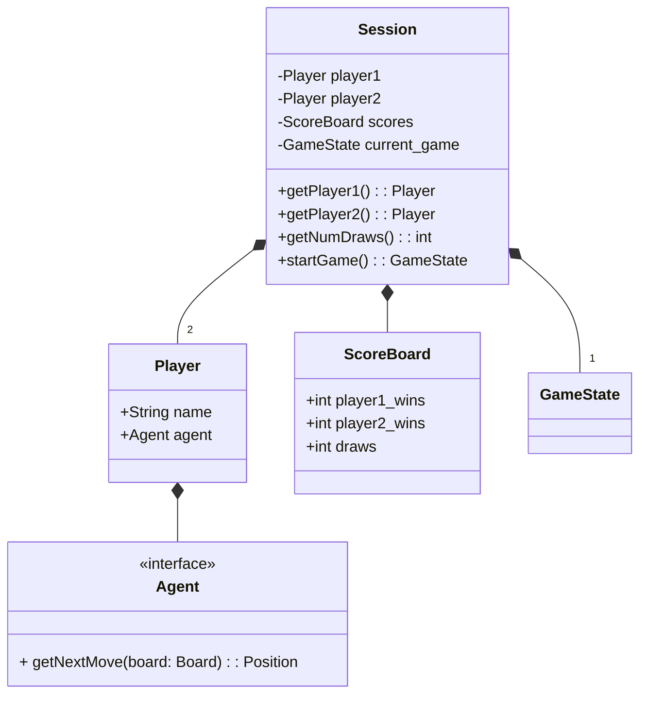

# Tic-Tac-Toe Game: Reference Architecture

## High-Level Design


## Domain Layer Design

### Data Model


### Game Logic

The logic for a single turn of the game can be summarized as follows:

```python
def takeTurn(state: GameState, position: Position, marker: Marker) -> MoveResult :

    if isValid (state.board, position, marker):
        new_board = state.board.withMove(position, marker)
        new_status = checkStatus(new_board)
        return GameState(new_board, new_status)
    else:
        return Error("Invalid move")
```

### Game Rules

The rules of the game consist of move validation and win/draw checking. The rules are as follows:

```python
def isValidMove(board: Board, position: Position, marker: Marker) -> bool:
    return board.isPositionWithinBounds(position) and board.isEmpty(position)
```

```python
def checkGameStatus(board: Board) -> GameStatus: 
    if hasThreeInARow(Marker::X):
        return GameStatus::X_WINS
    elif hasThreeInARow(Marker::O):
        return GameStatus::O_WINS
    elif board.isFull():
        return GameStatus::DRAW
    elif board.count(Marker::X) > board.count(Marker::O):
        return GameStatus::O_TURN
    else
        return GameStatus::X_TURN
```

## Application Layer Design

